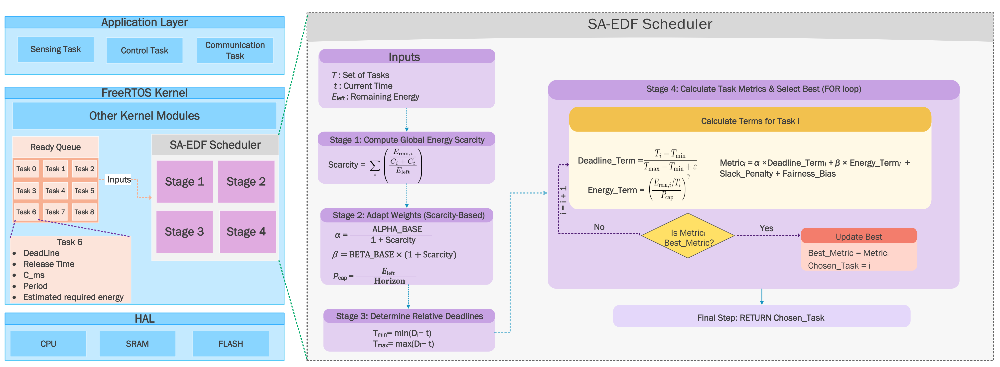
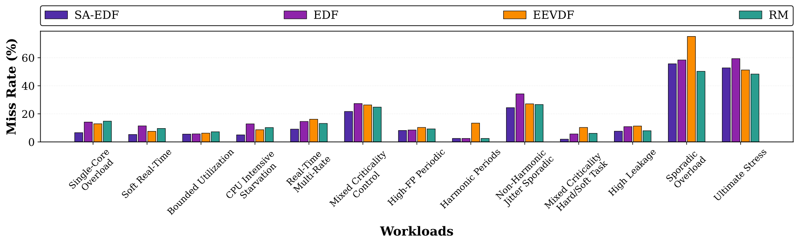
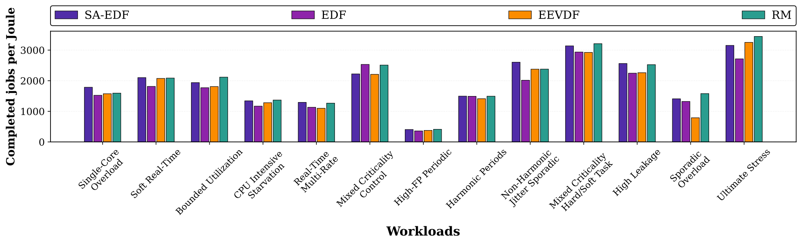
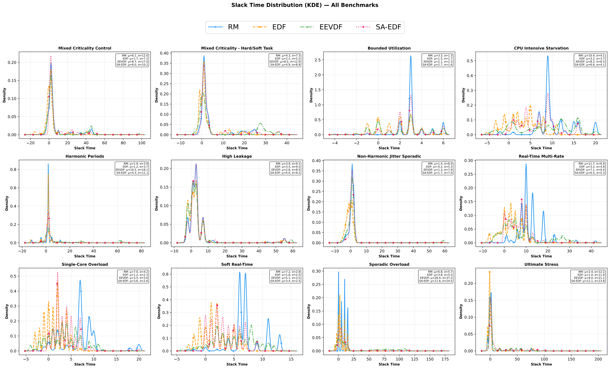
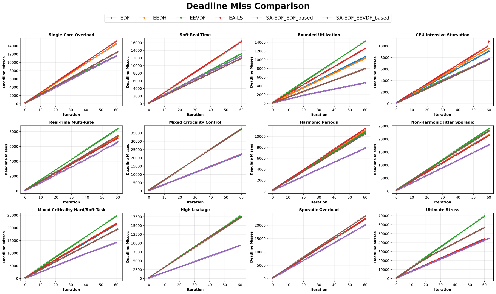
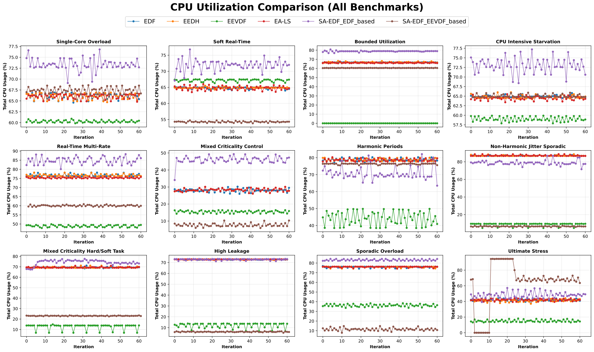

# SA-EDF: Shortage-Adaptive Earliest Deadline First Scheduler

[](LICENSE)
[](https://freertos.org)
[](https://doi.org/10.5281/zenodo.19763782)

---

## 📖 About

**SA-EDF** is a real-time scheduling algorithm designed for **intermittently powered cyber-physical systems** such as energy-harvesting IoT devices, batteryless sensors, and medical implants.

Conventional schedulers (EDF, RM, EEVDF) ignore short-term energy feasibility, causing wasted execution and deadline misses.  
SA-EDF solves this by dynamically adapting scheduling decisions based on:
- Task deadlines
- Remaining energy
- Execution feasibility
- Energy scarcity level

> 📄 This repository accompanies the paper:  
> *"SA-EDF: A Shortage-Adaptive Real-Time Scheduler for Intermittently Powered IoT Edge Devices"*  

---

##  Architecture



SA-EDF selects the next task to execute by minimizing a scalar metric **Mᵢ(t)** for each ready task at time **t**:

**Mᵢ(t) = α(t) × deadline_term + β(t) × energy_term + slack_penalty**

### Metric Components

| Component | Description |
|-----------|-------------|
| **deadline_term** | Normalized remaining time to deadline: $\frac{T_i - T_{min}}{T_{max} - T_{min} + \varepsilon}$ |
| **energy_term** | Energy feasibility: $\left(\frac{P_{req}}{P_{cap} + \varepsilon}\right)^\gamma$ where $P_{req} = \frac{E_i}{C_i} \cdot R_i(t)$ |
| **slack_penalty** | Prevents cascading misses:  $slack = R_i(t) - T_i(t)$ if $R_i(t) > T_i(t)$, otherwise $0$ |

### Adaptive Weights

The weights adapt based on energy scarcity:

$$scarcity = \frac{E_{need}}{E_{left} + \varepsilon}$$

$$\alpha(t) = \frac{\alpha_0}{1 + scarcity}$$

$$\beta(t) = \beta_0 \cdot (1 + scarcity)$$

- When **energy is abundant** ($scarcity \rightarrow 0$): SA-EDF behaves like classic EDF
- When **energy is scarce** ($scarcity \rightarrow \infty$): Energy term dominates, favoring feasible tasks

### Scheduling Decision

At each scheduling point, the task minimizing **$M_i(t)$** is selected:

$$i^*(t) = \arg \min_i M_i(t)$$

### Complexity

- **Time:** $O(N)$ per decision ($N$ = number of ready tasks)
- **Per-task operations:** ~28 arithmetic ops, ~9 memory accesses---

--
## 📊 Results

### Deadline Miss Rate



*Figure: Deadline miss counts across all benchmark workloads*

| Algorithm | Deadline Miss (%) |
|-----------|------------------|
| **SA-EDF** | **20.5%** |
| EDF        | 27.8% |
| RM         | 23.5% |
| EEVDF      | 28.8% |

> SA-EDF reduces deadline misses by **~26%** compared to EDF.

---

### Energy Efficiency



*Figure: Energy efficiency measured as completed jobs per joule*

| Algorithm | Relative Efficiency |
|-----------|--------------------|
| **SA-EDF** | **1.09x** |
| EDF        | 1.00x |
| RM         | 1.14x |
| EEVDF      | 1.02x |

---

### Slack Time Distribution



*Figure: Slack time distribution across all benchmarks*

SA-EDF maintains **positive slack** even under severe energy constraints, comparable to or better than RM.

---

### FreeRTOS Evaluation

#### Deadline Misses



*Figure: Deadline miss counts from FreeRTOS implementation*

| Algorithm | Relative Misses | Improvement |
|-----------|----------------|-------------|
| EDF       | 1.00×          | baseline    |
| **SA-EDF** | **0.82×**      | **+31.5%**  |

#### CPU Utilization



*Figure: CPU utilization for each workload (FreeRTOS)*

| Algorithm | CPU Utilization | Improvement |
|-----------|----------------|-------------|
| EDF       | 10.86%         | baseline    |
| **SA-EDF** | **11.73%**     | **+8.0%**   |

---


##  Quick Start 

### High-Level C Scheduler 

Compile: 

``` 
gcc -O2 -std=c11 -Wall -Wextra main.c -o scheduler -lm 
``` 

Compiler flags explained: 
- -O2 : Optimization level 2 
- -std=c11 : C11 standard 
- -Wall -Wextra : Enable all warnings 
- -lm : Link math library 

Run: 

``` 
./scheduler 
``` 

### FreeRTOS Simulation 

Navigate to the FreeRTOS demo directory: 

``` 
cd FreeRTOSv202411.00/FreeRTOS/Demo/CORTEX_MPS2_QEMU_IAR_GCC/build/gcc 
``` 

Build the project: 

``` 
make 
``` 

Run with QEMU emulator: 

``` 
qemu-system-arm -machine mps2-an385 -cpu cortex-m3 -kernel output/RTOSDemo.out -monitor none -nographic -serial stdio 
``` 


